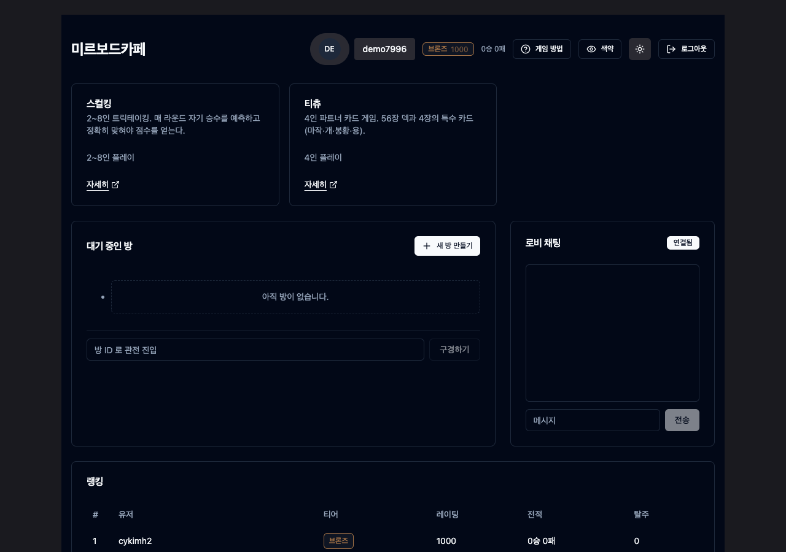
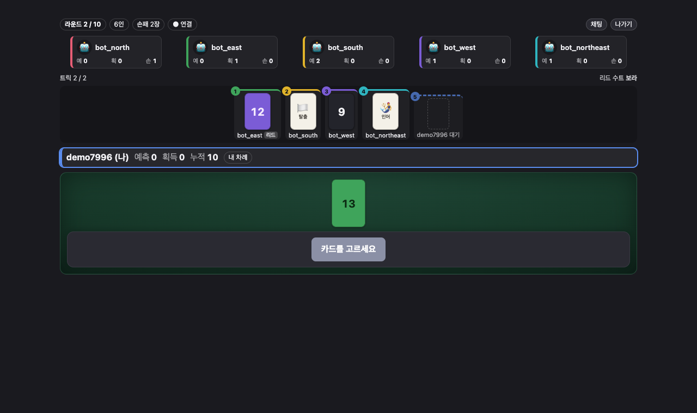
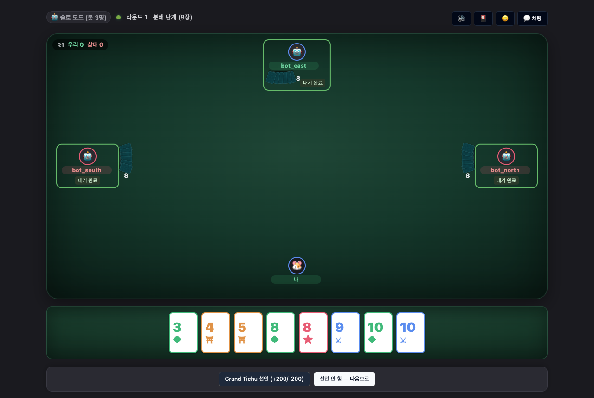

# Mirboard

**티츄·스컬킹 두 개의 턴제 보드게임이 실제로 돌아가는 서버 권위(server-authoritative)
실시간 웹 플랫폼.** 셔플·족보 판별·점수 계산·차례 결정은 전부 서버가 하고, 클라이언트는
입력기와 뷰어입니다.

[](https://github.com/cykimh/mirboard/actions/workflows/ci.yml)
[](https://github.com/cykimh/mirboard/actions/workflows/deploy.yml)

Spring Boot 4 / Java 25 · PostgreSQL · Redis · React + TypeScript ·
서버 테스트 733건 / 클라 239건

---


*미르보드카페 — 게임 카탈로그·방 목록/생성·관전·랭킹·로비 채팅이 한 화면*


*스컬킹 — 6인 트릭테이킹. 예측은 전원 제출 후 동시 공개, 트릭은 재생순으로 늘어놓는다*


*티츄 — 4인 2:2 팀전. 특수 카드 4종(마작·개·봉황·용)과 그랜드 티츄 선언*

---

## 무엇이 되는가

| | 티츄 | 스컬킹 |
| --- | --- | --- |
| 인원 | 4인 고정, 2:2 팀전 | **2~8인 가변**, 개인전 |
| 덱 | 56장 + 특수 카드 4종 | 70장(4색 × 1~14 + 특수 5종) |
| 매치 | 목표 점수(기본 1000점) | 10라운드 고정 |
| 특징 | 족보 조합, 폭탄 인터럽트, 카드 패스 | 승수 예측 후 동시 공개, 비추이적 트릭 판정 |

- **로비/방** — 방 생성(인원 선택)·입장·관전·랭킹·채팅. 게임 시작은 정원 충족 + **전원 준비**
- **봇** — 빈 좌석을 합법 수 균등 분포 봇으로 자동 충족 (휴리스틱은 의도적 후속 과제)
- **재접속·탈주** — 끊김 유예 후 미복귀 시 게임별 규칙으로 처리
- **UI** — 라이트/다크 토글, 모바일 반응형, 색약 모드

ELO·전적 영속은 **티츄 전용**입니다. 스컬킹은 `users.rating` 을 게임별로 분리할지가
선행 결정이라 의도적으로 보류했습니다 ([D-102](docs/decisions.md)).

전체 기능 표: [docs/implementation-status.md](docs/implementation-status.md)

---

## 기술적으로 흥미로운 지점

### 1. 두 번째 게임이 추상화의 결함을 정확히 한 곳 찾아냈다

`GameEngine` 포트(149줄) 뒤에 티츄 4,042줄과 스컬킹 2,919줄이 꽂힙니다. 스컬킹을 붙일 때
**REST/WS 컨트롤러·스케줄러·브로드캐스터·로비는 한 줄도 바뀌지 않았고**, 인프라에
`skullking` 참조는 0건입니다.

바뀐 건 포트 계약 한 곳입니다 — `boolean desert(...)` 는 "매치를 강제 종료했는가"라는
2치라서, 개인전의 "남은 사람끼리 계속"을 표현할 수 없었습니다. 티츄만 있을 때 이 계약은
완벽해 보였습니다.

**추상이 어디서 샜는지 말할 수 있다는 것**이 "처음부터 완벽했다"보다 강한 증거라고 봅니다.

→ [케이스 스터디: 두 번째 게임을 붙이기까지](docs/case-study-multi-game.md) ·
[포트 계약](docs/game-port.md)

### 2. 비추이적 트릭 판정을 6단 사다리로

스컬킹의 해적 > 인어 > 스컬킹 > 해적 은 **3자 순환**이라 `Comparator` 로 표현할 수 없고,
거기에 "셋이 다 나오면 인어 승"이라는 예외까지 얹힙니다.

```java
// 실제 코드에서 EffectiveKind. 접두만 생략
private record Rung(Predicate<Context> applies, ToIntFunction<Context> pick) {}

private static final List<Rung> LADDER = List.of(
        // 1. 스컬킹+인어 → 인어 (3자 예외)
        new Rung(c -> c.has(SKULL_KING) && c.has(MERMAID), c -> firstOfKind(c, MERMAID)),
        // 2~4. 스컬킹 → 해적 → 인어
        new Rung(c -> c.has(SKULL_KING), c -> firstOfKind(c, SKULL_KING)),
        new Rung(c -> c.has(PIRATE),     c -> firstOfKind(c, PIRATE)),
        new Rung(c -> c.has(MERMAID),    c -> firstOfKind(c, MERMAID)),
        // 5. 색상 카드 (검정 우선, 없으면 리드 수트)
        new Rung(c -> c.has(SUIT),       TrickResolver::highestSuitCard),
        // 6. 전부 탈출 → 먼저 낸 사람
        new Rung(c -> true,              c -> firstOfKind(c, ESCAPE)));
```

모든 단의 selector 가 `firstOfKind` 라서 **동점 처리("그 종류를 먼저 낸 사람")가 분기 없이
공짜로 성립**합니다. 검증은 스컬킹/해적/인어 존재 여부 8조합 전수 대조입니다.

→ [코드](server/src/main/java/com/mirboard/domain/game/skullking/trick/TrickResolver.java) ·
[테스트](server/src/test/java/com/mirboard/domain/game/skullking/trick/TrickResolverTest.java) ·
[룰 명세](docs/rules-skullking.md)

### 3. 상태 은닉을 런타임 필터가 아니라 타입으로

스컬킹의 "예측은 전원 제출 후 동시 공개" 룰은 **값을 실을 자리가 없어서** 지켜집니다.

```java
/** 예측을 냈다는 사실만 공개 — 값은 담지 않는다 (§5 동시 공개). */
record BidSubmitted(int seat) implements SkullKingEvent {}
record BidsRevealed(Map<Integer, Integer> bids) implements SkullKingEvent {}
```

손패도 같은 원리입니다 — 공개 `TableView` 와 본인용 `PrivateHand` 를 **다른 타입**으로
두고, 라우팅은 `GameEvent.privateSeat()` 단일 지점에서만 갈립니다. 좌석이 방 범위 밖이면
토픽으로 폴백하지 않고 **버립니다**. 새는 경로 자체가 없는 구조입니다.

→ [포트](server/src/main/java/com/mirboard/domain/game/core/GameEvent.java) ·
[STOMP 계약](docs/stomp-protocol.md)

### 4. 수평 확장을 "증명"으로 다뤘다

> 단일 인스턴스에서 안 깨졌다는 건 증명이 아니다.

같은 Redis/Postgres 를 문 **독립 Spring 컨텍스트 2개**를 띄워 교차 발화, A 종료 후 B 인계,
중복 실행 0건을 통합 테스트로 검증했습니다. in-memory 였던 3곳(세션 레지스트리·턴 타임아웃·
탈주 유예)을 Redis 로 옮기면서 초기 전제([D-03](docs/decisions.md))를 D-96 에서 명시적으로
번복했습니다. 리더 선출 대신 원자 pop + generation 이중 방어를 택한 논거는 코드 주석에
남겼습니다.

이 과정에서 폴링 지연 때문에 타임아웃 IT 가 **실제로 깨져** 주기를 1s → 250ms 로 내렸습니다.

→ [Redis 키 설계](docs/redis-keys.md)

---

## 아키텍처 4원칙

각 원칙 뒤에 **무엇이 그것을 강제하는가**를 함께 적습니다.

- **Modular Monolith** — `domain.lobby` → `domain.game.tichu` 직접 의존 금지.
  강제: 게임 디스패치가 `GameRegistry` 를 반드시 거친다.
- **Server-Authoritative** — 셔플·족보·점수·차례가 전부 서버.
  강제: 클라가 보낸 `seq` 는 무시하고 `room:{id}:seq` INCR 만 신뢰.
- **State Hiding** — 손패는 `/user/queue` 로만.
  강제: 타입 분리 + 단일 라우팅 지점(폴백 경로 없음).
- **개인정보 최소화** — `users` 에 email·phone·real_name 등은 **스키마 레벨에서 추가 금지**.
  증거: 칩 잔액을 `users` 에 넣었다가(V6) 원칙 위배로 **DROP 하고**(V7) Redis 방 단위로
  옮겼습니다. 원칙이 이미 배포된 스키마를 되돌리게 만든 사례입니다.

```
로그인 → 미르보드카페(/games) → 대기실(전원 준비) → 게임판
          방 목록·생성·관전·랭킹·채팅
```

상세: [docs/architecture.md](docs/architecture.md)

---

## 기술 스택

| 영역 | 선택 |
| --- | --- |
| Backend | Spring Boot 4.0.1 / Java 25 (Virtual Threads), Gradle 9.4.1 |
| Data | PostgreSQL 16 (Flyway V1~V10), Redis 7 + **Lua 원자 스크립트 9개** |
| Realtime | WebSocket + STOMP (SockJS 폴백) |
| Frontend | Vite + React 18 + TypeScript, Zustand, Tailwind + shadcn/ui |
| Test | JUnit 5 + Mockito + Testcontainers / Vitest + RTL |

`HandType`·`GameAction`·`GameEvent` 는 **sealed interface** 로 두어 `switch` 패턴 매칭이
누락 케이스를 컴파일 타임에 잡게 했고, 상태 객체는 record + `with*` 불변 전이입니다.

---

## 30초 실행

```bash
./scripts/dev.sh all
```

Postgres·Redis 기동 → 마이그레이션 → 서버(:8080) → 클라(:5173) 까지 한 번에 올라갑니다.
개별 실행은 `./scripts/dev.sh up | server | client`.

환경 설치·테스트 실행·검증 스크립트는 → **[CONTRIBUTING.md](CONTRIBUTING.md)**

---

## 문서

**훑어보기** — [아키텍처](docs/architecture.md) ·
[포트 설계](docs/game-port.md) ·
[케이스 스터디](docs/case-study-multi-game.md) ·
[의사결정 이력](docs/decisions.md)

**깊이 보기** — [REST API](docs/api.md) ·
[STOMP 프로토콜](docs/stomp-protocol.md) ·
[Redis 키](docs/redis-keys.md) ·
[티츄 룰](docs/rules-tichu.md) ·
[스컬킹 룰](docs/rules-skullking.md) ·
[구현 현황](docs/implementation-status.md)

**돌려보기** — [기여 가이드](CONTRIBUTING.md) ·
[배포](docs/deploy.md) ·
[수동 검증 시나리오](docs/qa-scenarios.md) ·
[백업 런북](docs/runbooks/) ·
[부하 테스트](scripts/k6/)

의사결정 이력은 100여 건이고, **번복을 지우지 않고 마커로 남깁니다** — 예를 들어
"단일 인스턴스 전제"(D-03)는 D-96 에서, "칩을 계정에 둔다"(D-81)는 D-82 에서 뒤집혔습니다.
진행 단계는 [로드맵](docs/plans/mvp-roadmap.md).
